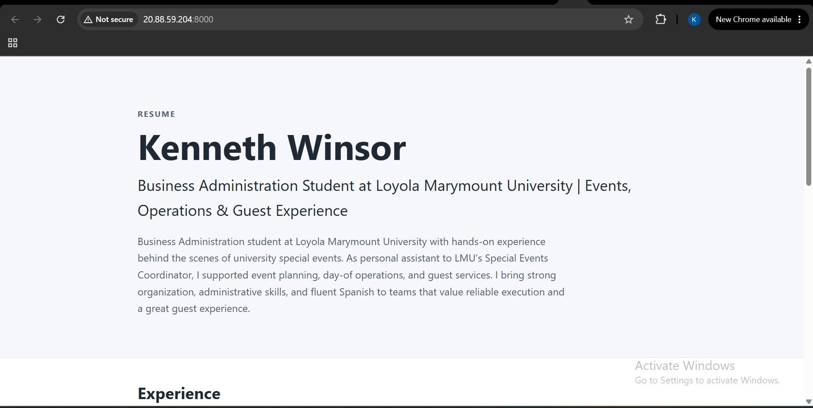

# Exercise 03: Build it, then move it

The region for the VM subscription wouldn't work initially, but(4) fixed it through just checking whats available and also trial and error. additionally vs code was having python issues after an update but(4) I got it to work using browser claude. 

## 1. The VM

| | |
|---|---|
| Name | `vm-career-platform` |
| Resource group | `rg-career-platform` |
| Region | North Central US (`northcentralus`) |
| Size | `Standard_B2ats_v2` (2 vCPU, 1 GiB RAM, x64) |
| OS | Ubuntu Server 24.04 LTS |
| Public IP | `20.88.59.204` |

## 2. The site on the VM's public IP

Taken while the temporary `Temp-HTTP-8000` rule was open, then closed again.

## 3. What went wrong, how I investigated, and what confirmed the fix

**The planned VM couldn't be created.** The class settings called for West US 2 and `Standard_B2ts_v2`. Listing the subscription's policy assignments showed that Azure for Students only allows five regions, and West US 2 isn't one of them; listing SKUs showed `B2ts_v2` wasn't offered to my subscription in the allowed regions either. I compared prices for the sizes that were actually available and chose `Standard_B2ats_v2` in North Central US, which has the same 2 vCPU / 1 GiB. `az vm create` returning `VM running` confirmed it.

**The repo had no lock file, and the tests couldn't run.** My migration plan said "uv sync from the lock file", but there was no `uv.lock`. After creating one, pytest stopped before running any tests because Starlette 1.7's test client needs `httpx2`, which wasn't in the dev dependencies. After I added it, 8 tests still failed. Reading the tracebacks showed all 8 hit the same line, `app/content/fallback.py:48`, which opens a folder to fsync it, something Windows doesn't allow. That same bug had also stopped me from loading my resume into the database. After a small fix that only runs that step on Linux/macOS, the suite went from 23 passed / 8 failed to 31 passed.

**SSH stopped working mid-migration.** SSH to the VM started timing out. The VM was still running, so I checked my laptop's public IP and found it had changed, while the firewall rule only allowed the old one. Updating the rule's source fixed it, and a successful `ssh ... hostname` confirmed it.

**The plan had a wrong check.** Step 6.2 ran `alembic current`, which failed with "DATABASE_URL is not set" even though `.env` was correct. `alembic/env.py` reads the variable from the shell environment, not from `.env`. Loading `.env` first fixed it (`0001 (head)`), and I corrected the plan.

**What confirmed the migration worked:** the Verify table in the migration plan. `/health` returned `{"status":"ok"}`, `/` returned `200`, the page showed my name from the database, there was no fallback file it could have come from instead, and the database hash was unchanged after serving pages.

## 4. The change

> You're at a coffee shop and try to SSH into your VM to fix a typo. The command hangs.

The VM's firewall only allows SSH from my home laptop's IP address, and the coffee shop gives me a different public IP, so Azure silently drops the connection and SSH just hangs. To fix it, I'd look up my current IP and add it to the SSH rule (or switch the rule to the new IP) with the Azure CLI or portal, then remove it when I leave. It costs a few minutes and an extra step every time I change networks, and while the rule allows the coffee shop's address, anyone else behind that same shared IP can also reach my SSH port (they'd still need my key).
